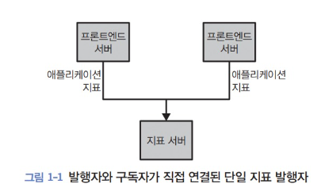

- # 카프카 시작하기

- ## 카프카가 생긴 배경

    ### 발행/구독 메세지 전달
  카프카에 대해서 이해하기 위해서는, 발행/구독 메세지 전달의 개념을 먼저 알아야한다.
  발행/구독 메세지 전달 방식은 전송자가 데이터를 보낼때, 직접 수신자에게 데이터를 보내지 않는다. 전송자는 메세지 분류하여 발행하고, 수신자는 메세지를 구독하는 방식이다. 이를 중간에 브로커가 메세지를 전달받고, 중계해주는 방식이다. 

  프론트엔드 서버에서 애플리케이션 지표를 받아서, 지표 서버에 저장하는 시스템을 통해 설명하겠다.
  
  
  
  처음에는 간단하게 가운데에서 메시지 큐나 통신 채널을 놓아서 해결하게 된다.
  그러나 이 방식은 발행자와 구독자가 많아지면, 연결을 추척하기 어려워진다.
  
  

  이를 해결하기 위해서, 모든 애플리케이션에서 데이터를 받아서, 이를 전달해주는 서버를 추가하면 된다.
  그러면 다음과 같이 복잡성이 줄어든 아키텍처를 만들수 있다.
  
  
  
  그러나 여기에서는 단순히 지푯값에 대한 데이터만 발행/구독을 하고있는데, 만약 다른 로그 메시지나 사용자 추척 정보가 추가된다면 다음과 같이 다시 복잡하게 변경된다.
  
  
  
  이를 해결하기 위해서는 중앙 집중화된 시스템이 필요하다. 카프카는 이러한 문제들을 해결하기 위해서 탄생하게 되었다. 

- ## 카프카 입문
  카프카는 '분산 커밋 로그' 또는 '분산 스트리밍 플랫폼' 이라고 불리기도 한다. 카프카에 저장된 데이터는 순서를 유지하고, 지속성 있게 보관되며, 결정적으로 읽을 수 있다. 또한 확장에 열려있고, 실패에 저항력을 가지기 위해서 데이터를 분산시켜 저장할 수 있다.
  
  카프카에 있는 요소들은 다음과 같다

  1. 메시지와 배치
  2. 스키마
  3. 토픽과 파티션
  4. 프로듀서와 컨슈머
  5. 브로커와 클러스터

  ### 메시지와 배치
  
  메시지는 카프카의 기본 단위로써, 특정한 형식이나 의미가 없다. 다만 메시지는 키라는 메타데이터를 가질수 있는데, 이는 메시지가 저장되는 파티션을 결정하는데 사용된다.
  카프카는 메시지를 효율성을 위해 배치 단위로 저장한다.

  ### 스키마

  카프카의 메시지는 단순한 바이트 배열이지만, 내용을 이해하기 쉽게 일정한 스키마를 부여하는 것이 권장된다. 가장 간단한 방법으로는 JSON, XML이 있지만, 카프카 개발자들은 아파치 AVRO를 선호한다.
  
  ### 토픽과 파티션
  
  카프카에 저장되는 메시지는 토픽 단위로 분류된다. 이는 데이터베이스의 테이블이나, 파일 시스템의 폴더와 비슷한 역할을 한다.
  토픽은 파티션 단위로 분류된다.
  파티션은 저장될때, append-only 하는 방식으로 추가되며, 읽을 때는 처음부터 맨 끝까지 읽는다.  
  파티션은 다른 서버에 저장될 수 있고, 복제 가능해서, 여러 서버에 수평적으로 확장가능하게 하고, 오류 발생시에도, 다른 서버에서 처리할 수 있게 한다.

  

  ### 프로듀셔와 컨슈머

  - 프로듀셔
  
    프로듀셔는 메시지를 생성한다. 발행/구독 시스템에서 발행자나 작성자 라고 불린다. 특정한 토픽에 메시지를 작성하는 방식이다. 메시지는 기본적으로 파티션들에 고르게 나누어서 작성되지만, 사용자가 파티션을 골라서 작성할수 있다.
  - 컨슈머 
    컨슈머는 메시지를 읽는다. 다른 발행/구독 시스템에서 구독자나 독자 라고 불린다. 컨슈머는 1개 이상의 토픽을 구독하여, 메시지를 읽어온다. 메시지의 오프셋을 기록해서 메시지를 어디까지 읽었는지 저장한다.

  ### 브로커와 클러스터

  - 브로커
    하나의 카프카 서버를 브로커 라고 부르며, 프로듀서가 생산한 메시지를 받아서, 디스크 저장소에 쓴 다음, 이를 컨슈머에게 전달하는 역할을 맏는다.
  - 클러스터
    브로커는 클러스터로 작동하게 설계되었다. 하나의 클러스터 내에 여러개의 브로커가 존재하게 되고, 그중 하나를 파티션 리더로, 컨트롤러의 역할을 하게 한다.
    컨트롤러는 파티션을 브로커에 할당해주고, 장애를 모니터링 한다.

